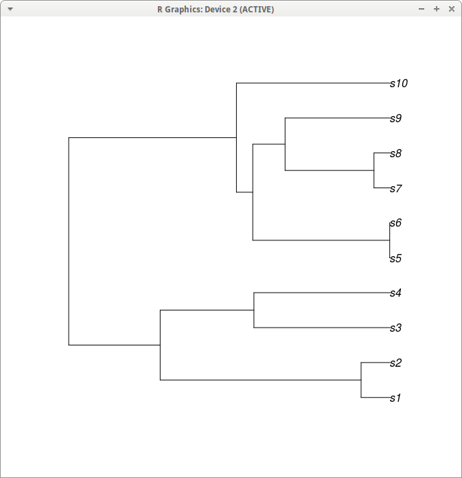

# Novel artificial neural networks applications in phylogenetics.
By: Jorn Prenger and Anne Hinrichs

## Can deep neural networks be used in phylogentics and if so how can phylogenetics benefit from it? 
In this report we will examine if deep learning can be used for phylogenetics. We will also try to find out in what way they can be used, and try to give examples.

## What is a neural network?

A neural network is a programming sturcture which tries to simulate the neurons in the brain. Is does this to try to discover patterns in large sets of data. Then it uses the discovered patters to look at new data, and say something about this data. The complexity of the patterns it discovers (and its ability to discover complex patterns) grows with the amount of neurons and layers the network. It can then use this pattern to classify things it hasn't seen before.[7][4]

### How does a neural network work?

As said before a neural network consists of neurons. These neurons are organised in layers, and the layers communicate with each other. The neurons send data in the form of numbers back and forth. The neurons all perform some basic calculations on the data they recieve, multiply this by the weight, and output it. After all the neurons have done their job you compare the ouput state with the state it should have been. (You know because you are training.) If it matches pretty good you are done training, if it doesn't match at all you adjust the weights by looking what each neuron said before it was multiplied by the weight. You then make the weights higher or lower and try the process again. 

### What is (un)supervised learning

* Unsupervised
  
Unsupervised machine learning is the machine learning task of inferring a function to describe hidden structure from unlabeled        data. This way you can let the program train itself without having to interfere in any way.
  
 * Supervised
  
Supervised learning is the machine learning task of inferring a function from labeled training data. The program just generates the output and says if this is right or not. After this it changes the values like discribed above.

### What is a deep neural network?
 
A deep neural network is a neural network which uses multiple hidden layers. This type of networks can be used to execute far more complex tasks, but the layers also make the network almost impossible to understand.


## What is an API
An API makes it easier for programmers to interact with hardware, databases and other stuff. It combines certain actions to save programmers from having to write the same standard code all the time. An API also standardises the communications with the hardware drivers. This makes sure you don't have to write a different program for every different system. It is all to make it easier for programmers to develop applications using these prebuild things. [5]

### Google's deep learning API
Google's deep learning API Tensorflow is an open source deep learning platform which we want to use to practice with using deep neural networks. Tensorflow is already being used in other fields of biology like drug research.[8]

## What is a neural network used for?

A neural network is used to discover patterns in large datasets and make predictions using these patterns. Some examples:

 * Deep Learning for Population Genetic Inference. [1]

 * Constructive Autoassociative Neural Network for Facial Recognition. [3]
 
 * For image and speech recognition. [4]
 
 * It is used in phylogenetics for asigning unknown DNA to an animal group [6]
 
 * For drug research [8]

## What are the pros and cons of deep learning?

### pros

* They have very accurate predictions and outcomes.
* You can train them in things computers couldn't do before.[3]
* You can get them to discover very complex patterns in large datasets.

### cons 

* They are slow to train without a good gpu.
* They need lots of training data. [8]
  
## What are phylogenetics?

Phylogenetics is the study of the evolutionary history and relationships among individuals or groups of organisms. This means it studies the relations and differences between species. To clarify these relations phylogenetic trees are made. In these trees you can also see when a specie splits into two different species. The field we are interested in is the length of the lines of these trees, which represent the time before a specie split. We also want to know if a specie just transforms instantly into two, or if this process takes time in which the specie's organisms start to grow apart due to evolution.


## On wich type of phylogenetics can we asign neural networks?

1. We could use neural networks in phylogenetics to simulate animals and make a phylogeny out of that, so you could see how animals speciate. This would be good, because then, you could control a phylogeny more.

2. We could also use a neural network to find the parameters for the maximum likelihood function from the data in the tree. After you have found the parameters you could input the data of the tree and the parameters, and then it could guess the maximum likelihood formula.

### How could we do that

1. You first have to make a realistic simulation of animals, this has been done many times. You then need to find a way to get it to run quick enough to get a phylogeny without having to wait too long because you will need a lot of training data to feed to the neural network. This might be hard because you would need a lot of computing power.

2. You can use generated phylogenies with predefined parameters(as seen below) to feed to the neurons(the amount of neurons is dependent on the amount of taxons) and train it with them. It then has too guess the parameters and after a while it should be able to guess the parameters correctly, if you have enough neurons and layers. Then, by having the input of the tree and the parameters, the neural network could guess the maximum likelihood formula.

For example you could use a python script or tensorflow to make a neural network, then feed the data from the phylogeny (which you can generate in R or use methode 1) to all the neurons. Then train it in a way, that it then generates two outputs, your spieciation rate and your extinction rate.

## R output

This tree:


[]()

has this Newick:

```
(((s1:1.011295744,s2:1.011295744):6.969391358,(s3:4.728753361,s4:4.728753361):3.251933741):3.172728319,(((s5:0.01815400785,s6:0.01815400785):4.750604823,((s7:0.5641030215,s8:0.5641030215):3.083854501,s9:3.647957523):1.120801308):0.5666936288,s10:5.33545246):5.817962961);
````

has these edges:

```
print(tree_reconstructed$edge)
      [,1] [,2]
 [1,]   11    1
 [2,]   11   12
 [3,]   12   13
 [4,]   13   14
 [5,]   14    2
 [6,]   14   15
 [7,]   15    3
 [8,]   15    4
 [9,]   13   16
[10,]   16   17
[11,]   17   18
[12,]   18    5
[13,]   18    6
[14,]   17   19
[15,]   19    7
[16,]   19    8
[17,]   16    9
[18,]   12   10
```

has these edge lengths:

```
> print(tree_reconstructed$edge.length)
 [1] 10.0028245  0.1130859  2.2940680  4.8257084  2.7699622  1.6000831  1.1698791
 [8]  1.1698791  3.9565639  0.1177556  0.9994423  2.5219089  2.5219089  2.2418723
[15]  1.2794789  1.2794789  3.6391068  9.8897387
```

### What software to use for neural networks

* Tensorflow, we already explained what this is.
* Numpy, This is a python module whichyou can use to execute more complex mathematical functions in python.

## References


* [3] Fernandes BJT, Cavalcanti GDC, Ren TI (2014) Constructive Autoassociative Neural Network for Facial Recognition. PLoS ONE 9(12): e115967. https://doi.org/10.1371/journal.pone.0115967

* [1] Sheehan S, Song YS (2016) Deep Learning for Population Genetic Inference. PLoS Comput Biol 12(3): e1004845. https://doi.org/10.1371/journal.pcbi.1004845

* [4] Li Deng and Dong Yu (2014), "Deep Learning: Methods and Applications", Foundations and Trends® in Signal Processing: Vol. 7: No. 3–4, pp 197-387. http://dx.doi.org/10.1561/2000000039

* [2] LeCun, Yann, Yoshua Bengio, and Geoffrey Hinton. "Deep learning." Nature 521.7553 (2015): 436-444.
http://www.nature.com/nature/journal/v521/n7553/abs/nature14539.html 

* [5] Clarke, Steven (2004). "Measuring API Usability". Dr. Dobb's. Retrieved 29 July 2016.

* [6] Halgaswaththa, Thilini, et al. "Neural network based phylogenetic analysis." Biomedical Engineering (ICoBE), 2012      International Conference on. IEEE, 2012.

* [7] Haykin, Simon, and Neural Network. "A comprehensive foundation." Neural Networks 2.2004 (2004): 41.

* [8] Ramsundar, Bharath, et al. "Massively multitask networks for drug discovery." arXiv preprint arXiv:1502.02072 (2015).

* [9] Fritzke, Bernd. "Growing cell structures—a self-organizing network for unsupervised and supervised learning." Neural networks 7.9 (1994): 1441-1460.
